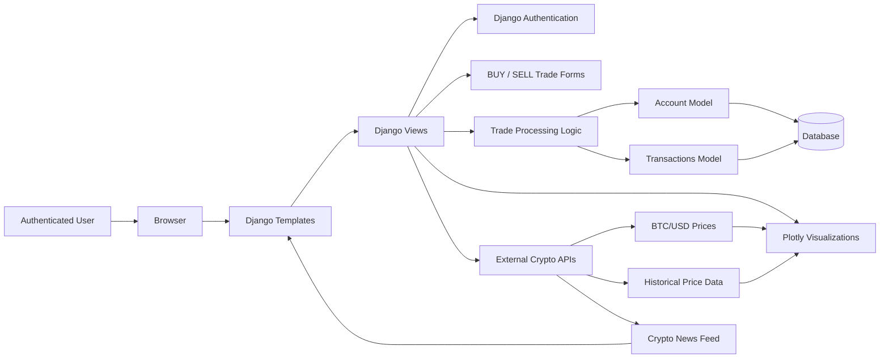

# Project 4: Python Django - Bitcoin Trading Application

# Mach Trade

**Mach Trade** is a Django-based cryptocurrency trading simulator that allows authenticated users to practice hypothetical Bitcoin trading against USD without risking real money.

The application combines Django authentication, database-backed account and transaction models, external cryptocurrency market APIs, and Plotly visualizations to help users place simulated BUY/SELL trades, monitor balances, review transaction history, and analyze Bitcoin price trends.

---

## Overview

Mach Trade is a full-stack Django web application focused on simulated BTC/USD trading. Users can register, log in, receive a simulated starting balance, place hypothetical trades, and track their portfolio performance through an interactive dashboard.

The project is designed as a portfolio-ready finance application that demonstrates:

- Django authentication and session-based user access
- Database modeling for user accounts and transactions
- Simulated cryptocurrency trading logic
- External API integration for crypto market data
- Plotly-powered financial charts and visualizations

> **Note:** This project is for educational and portfolio purposes only. It does not execute real cryptocurrency trades or provide financial advice.

---

## Key Features

- User registration, login, logout, and authenticated dashboard access
- Simulated BTC/USD BUY and SELL trading workflows
- Starting simulated USD balance for hypothetical trading practice
- Account model for tracking USD balance and Bitcoin holdings
- Transaction model for recording trade history
- External API integration for Bitcoin prices, historical market data, and crypto news
- Plotly and Plotly.js charts for portfolio and price visualizations
- Portfolio dashboard showing balances, quotes, news, and transaction history
- Reset functionality to restart the simulated trading experience


## Project Scope

Mach Trade is scoped as a **cryptocurrency trading simulator**, not a real brokerage platform.

The application allows users to practice trading decisions in a controlled simulated environment. It focuses on demonstrating full-stack Django development skills through authentication, database-backed user portfolios, trade-processing logic, external API requests, and interactive visualizations.

---

## System Architecture



**Install instructions**

**1.**  Clone the repoistory

```
git clone https://github.com/mheerspink75/Django-Plotly-Dash.git
```

**2.** Create a virtual environment in the cloned project directory

```
python -m venv .venv
```

**3.**  Activate the virtual environment

```
source .venv/Scripts/activate
```

**4.**  Install the dependencies from requirements.txt

```
pip install -r requirements.txt
```

**5.**  Collect the static files

```
py manage.py collectstatic
```

**6.**  Migrate the Database

```
py manage.py makemigrations app1
py manage.py migrate
```

**7.** Create a user account and log in

```
py manage.py createsuperuser
```

**8.** Run the dev server

```
py manage.py runserver
```

dev server address:  http://127.0.0.1:8000/
